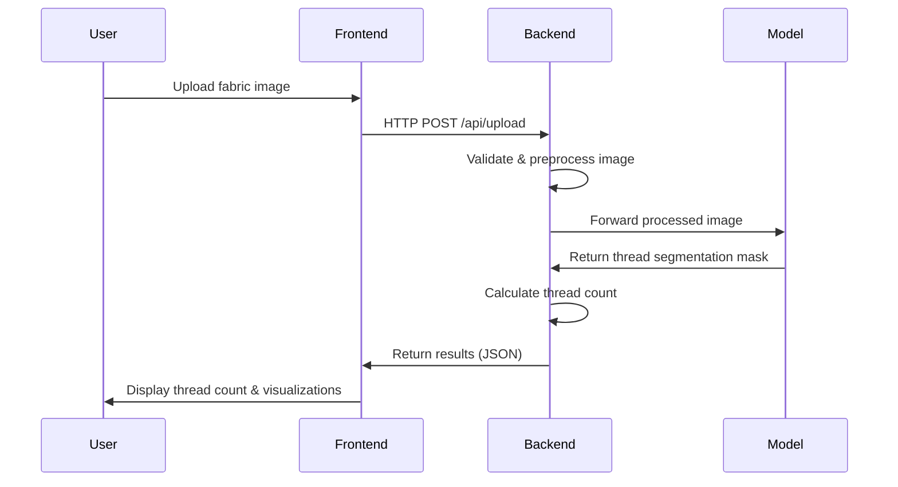

# 🏗️ System Architecture

## Overview

The Automated Thread Density Analysis system follows a clean separation of concerns with a modern web architecture pattern. The system comprises three main components:

1. **React.js Frontend** - User interface for image upload and result visualization
2. **FastAPI Backend** - Server for handling requests, image processing, and model serving
3. **Deep Learning Model** - Neural network for thread pattern detection and segmentation


## Component Interaction Flow



## Frontend Architecture

The React.js frontend follows a component-based architecture:

- **App Container**: Main application wrapper with routing
- **ImageUploader**: Handles fabric image upload with drag-and-drop
- **ProcessingView**: Displays processing status and progress
- **ResultsView**: Visualizes thread count and segmentation masks
- **ThreadAnalytics**: Shows statistical data and charts

## Backend Architecture

The FastAPI backend is structured as follows:

- **API Layer**: Endpoint definitions and request handling
- **Service Layer**: Business logic and orchestration
- **Processing Layer**: Image preprocessing pipeline
- **Model Layer**: Deep learning model integration
- **Utility Layer**: Helper functions, logging, and error handling

## Data Flow

1. **Image Upload**: User uploads fabric image through frontend
2. **Preprocessing**:
   - Image validation
   - Resizing to model input dimensions
   - Grayscale conversion
   - Noise reduction
   - Edge enhancement
3. **Inference**:
   - Processed image is fed to the deep learning model
   - Model generates thread segmentation mask
4. **Post-processing**:
   - Thread counting algorithm processes the mask
   - Warp and weft threads are identified and counted
   - Thread density is calculated per square inch
5. **Result Delivery**:
   - JSON response with thread count metrics
   - Visual overlays for thread detection
   - Quality assessment based on thread density

## API Endpoints

| Endpoint | Method | Description | Request | Response |
|----------|--------|-------------|---------|----------|
| `/api/upload` | POST | Upload fabric image | `multipart/form-data` with image | Upload confirmation with image ID |
| `/api/predict` | POST | Process image and return results | JSON with image ID | Thread count results and mask URLs |
| `/api/status` | GET | Check processing status | Query param: image ID | Processing status and progress |
| `/api/results/{image_id}` | GET | Get stored results | Path param: image ID | Full analysis results |

## Model Architecture

The deep learning model follows a U-Net architecture with a ResNet backbone:

- **Input**: 512x512 preprocessed grayscale image
- **Encoder**: ResNet-34/50 for feature extraction
- **Decoder**: Transposed convolutions with skip connections
- **Output**: Binary segmentation mask identifying threads

## Communication Protocol

The frontend and backend communicate via RESTful HTTP requests with JSON payloads. For image uploads, `multipart/form-data` is used to efficiently transfer image files.

Example response from `/api/predict`:

```json
{
  "image_id": "img_123456",
  "success": true,
  "thread_count": {
    "warp": 120,
    "weft": 80,
    "total": 200
  },
  "quality_grade": "Premium",
  "processing_time_ms": 1240,
  "mask_url": "/results/img_123456/mask.png"
}
```

## Deployment Architecture

The system can be deployed using various strategies:

1. **Development**: Local deployment with React dev server and FastAPI development server
2. **Production**: Containerized deployment with Docker and nginx reverse proxy
3. **Cloud**: Cloud-based deployment on AWS/GCP/Azure with managed services


## Security Considerations

- HTTPS for all communications
- Input validation for all API requests
- Rate limiting to prevent DoS attacks
- Proper error handling to prevent information leakage
- Authentication for API access (JWT-based)

## Performance Optimizations

- **Model Optimization**: Quantization and pruning for faster inference
- **Caching**: Results caching to avoid redundant processing
- **Parallel Processing**: Multiple worker processes for handling concurrent requests
- **CDN Integration**: For serving static assets and result visualizations
- **Database Indexing**: For efficient result retrieval in multi-user scenarios

## Scalability Strategy

The system architecture supports horizontal scaling to accommodate increased load:

- **Stateless Backend**: Enables easy scaling of API servers
- **Load Balancing**: Distribution of requests across multiple instances
- **Worker Pools**: For handling intensive processing tasks
- **Containerization**: Docker-based deployment for consistent scaling
- **Microservices Evolution**: Potential to split into dedicated microservices as needed
