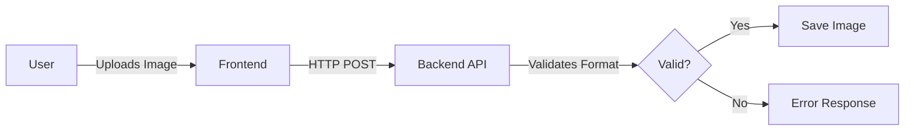

# 🔍 How It Works: From Image to Thread Count

This document walks through the step-by-step process of how our automated thread counting system transforms a fabric image into accurate thread density measurements.

## Complete Process Overview


The Automated Thread Density Analysis system follows a systematic approach to count threads in fabric images:

1. **Image Upload**: User submits a fabric image through the interface
2. **Image Preprocessing**: Raw image is prepared for analysis
3. **Deep Learning Segmentation**: U-Net model identifies threads
4. **Thread Pattern Analysis**: Computer vision algorithms separate and count threads
5. **Results Generation**: Thread counts are calculated and visualizations are created
6. **Results Display**: User interface presents findings in an intuitive format

Let's examine each stage in detail:

## 1. Image Upload & Validation

The process begins with the user uploading a fabric image through our React.js frontend:



**Key Steps:**
- Image format validation (JPEG, PNG, TIFF supported)
- Size constraints check (max 25MB)
- Initial quality assessment
- Unique ID assignment for tracking

## 2. Image Preprocessing Pipeline

Before the deep learning model can effectively identify threads, the image undergoes several preprocessing steps:


### 2.1 Image Normalization

```python
def normalize_image(image):
    """Normalize image for consistent processing."""
    # Resize to standard dimensions
    image = cv2.resize(image, (1024, 1024))
    
    # Convert to RGB if grayscale
    if len(image.shape) == 2:
        image = cv2.cvtColor(image, cv2.COLOR_GRAY2RGB)
    
    # Convert to grayscale for processing
    gray = cv2.cvtColor(image, cv2.COLOR_RGB2GRAY)
    
    return image, gray
```

### 2.2 Noise Reduction

```python
def reduce_noise(gray_image):
    """Apply noise reduction filters."""
    # Gaussian blur to reduce high-frequency noise
    denoised = cv2.GaussianBlur(gray_image, (5, 5), 0)
    
    # Non-local means denoising for preserving edges
    denoised = cv2.fastNlMeansDenoising(denoised, None, 10, 7, 21)
    
    return denoised
```

### 2.3 Contrast Enhancement

```python
def enhance_contrast(image):
    """Enhance contrast to improve thread visibility."""
    # CLAHE (Contrast Limited Adaptive Histogram Equalization)
    clahe = cv2.createCLAHE(clipLimit=2.0, tileGridSize=(8, 8))
    enhanced = clahe.apply(image)
    
    return enhanced
```

### 2.4 Edge Enhancement

```python
def enhance_edges(image):
    """Enhance edges to highlight thread boundaries."""
    # Sobel edge detection
    sobel_x = cv2.Sobel(image, cv2.CV_64F, 1, 0, ksize=3)
    sobel_y = cv2.Sobel(image, cv2.CV_64F, 0, 1, ksize=3)
    
    # Combine horizontal and vertical edges
    sobel_combined = cv2.magnitude(sobel_x, sobel_y)
    
    # Normalize to 0-255 range
    sobel_combined = cv2.normalize(sobel_combined, None, 0, 255, 
                                  cv2.NORM_MINMAX, cv2.CV_8U)
    
    return sobel_combined
```

### 2.5 DPI Calibration

```python
def calibrate_dpi(image, known_dpi=None):
    """Calibrate image DPI for accurate measurements."""
    if known_dpi:
        return known_dpi
    
    # Try to extract from EXIF if available
    try:
        exif_data = extract_exif_data(image_path)
        if 'XResolution' in exif_data:
            return exif_data['XResolution']
    except:
        pass
    
    # Default to standard resolution if unable to determine
    return 300
```

## 3. Deep Learning Model Inference

The preprocessed image is fed into our U-Net model for thread segmentation:


### 3.1 Model Input Preparation

```python
def prepare_model_input(preprocessed_image):
    """Prepare image for model input."""
    # Resize to model input size
    model_input = cv2.resize(preprocessed_image, (512, 512))
    
    # Normalize pixel values to 0-1 range
    model_input = model_input.astype(np.float32) / 255.0
    
    # Expand dimensions for batch size and channels
    model_input = np.expand_dims(model_input, axis=0)
    model_input = np.expand_dims(model_input, axis=3)
    
    return model_input
```

### 3.2 Model Inference

```python
def run_model_inference(model_input):
    """Run the thread detection model."""
    # Load model (assuming it's a TensorFlow/Keras model)
    model = tf.keras.models.load_model('thread_detection_model.h5')
    
    # Run inference
    thread_mask = model.predict(model_input)
    
    # Post-process the prediction
    thread_mask = thread_mask[0, :, :, 0]
    thread_mask = (thread_mask > 0.5).astype(np.uint8) * 255
    
    # Resize back to original dimensions
    thread_mask = cv2.resize(thread_mask, (1024, 1024))
    
    return thread_mask
```

## 4. Thread Pattern Analysis

Once the thread mask is generated, we analyze it to separate and count warp and weft threads:


### 4.1 Warp/Weft Thread Separation

```python
def separate_warp_weft(thread_mask):
    """Separate horizontal and vertical threads."""
    # Create kernels for morphological operations
    horizontal_kernel = cv2.getStructuringElement(cv2.MORPH_RECT, (25, 1))
    vertical_kernel = cv2.getStructuringElement(cv2.MORPH_RECT, (1, 25))
    
    # Apply morphological opening to isolate horizontal (weft) threads
    weft_threads = cv2.morphologyEx(thread_mask, cv2.MORPH_OPEN, horizontal_kernel)
    
    # Apply morphological opening to isolate vertical (warp) threads
    warp_threads = cv2.morphologyEx(thread_mask, cv2.MORPH_OPEN, vertical_kernel)
    
    return warp_threads, weft_threads
```

### 4.2 Thread Counting Algorithm

```python
def count_threads(thread_image, orientation='warp', dpi=300):
    """Count threads in the given binary image."""
    # Project the binary image
    if orientation == 'warp':
        # Sum across rows for vertical (warp) threads
        projection = np.sum(thread_image, axis=0)
    else:
        # Sum across columns for horizontal (weft) threads
        projection = np.sum(thread_image, axis=1)
    
    # Normalize projection
    projection = projection / np.max(projection)
    
    # Find peaks in projection (thread centers)
    peaks, _ = find_peaks(projection, height=0.2, distance=5)
    
    # Calculate threads per inch based on image DPI
    thread_count = len(peaks) * (dpi / thread_image.shape[0 if orientation == 'weft' else 1])
    
    return thread_count, peaks
```

### 4.3 Hough Transform Method

As an alternative or supplement to projection-based counting, we also implement a Hough Transform approach:

```python
def count_threads_hough(thread_image, orientation='warp'):
    """Count threads using Hough transform."""
    # Set parameters based on orientation
    if orientation == 'warp':
        min_theta = 80 * np.pi / 180
        max_theta = 100 * np.pi / 180
    else:
        min_theta = -10 * np.pi / 180
        max_theta = 10 * np.pi / 180
    
    # Apply Hough transform
    lines = cv2.HoughLines(thread_image, 1, np.pi/180, 
                          threshold=100, 
                          min_theta=min_theta, 
                          max_theta=max_theta)
    
    # Filter duplicate lines
    if lines is not None:
        filtered_lines = filter_similar_lines(lines, threshold=10)
        return len(filtered_lines)
    else:
        return 0
```

## 5. Results Generation

After counting the threads, the system generates comprehensive results including visualizations:

### 5.1 Thread Density Calculation

```python
def calculate_thread_density(warp_count, weft_count):
    """Calculate thread density metrics."""
    total_count = warp_count + weft_count
    warp_percentage = (warp_count / total_count) * 100
    weft_percentage = (weft_count / total_count) * 100
    
    result = {
        'warp_count': warp_count,
        'weft_count': weft_count,
        'total_count': total_count,
        'warp_percentage': warp_percentage,
        'weft_percentage': weft_percentage
    }
    
    return result
```

### 5.2 Results Visualization

```python
def create_result_visualization(original_image, warp_threads, weft_threads):
    """Create visual representation of detected threads."""
    # Create a copy of the original image
    visualization = original_image.copy()
    
    # Create colored masks
    warp_colored = np.zeros_like(original_image)
    warp_colored[warp_threads > 0] = [255, 0, 0]  # Red for warp
    
    weft_colored = np.zeros_like(original_image)
    weft_colored[weft_threads > 0] = [0, 0, 255]  # Blue for weft
    
    # Blend with original image
    alpha = 0.5
    visualization = cv2.addWeighted(visualization, 1.0, warp_colored, alpha, 0)
    visualization = cv2.addWeighted(visualization, 1.0, weft_colored, alpha, 0)
    
    return visualization
```

## 6. Results Display

Finally, the system presents the results to the user through the frontend interface:


### 6.1 Thread Count Summary

The thread count summary includes:
- Warp thread count (vertical threads)
- Weft thread count (horizontal threads)
- Total thread count
- Thread count relative to market standards
- Quality classification

### 6.2 Visual Thread Overlay

The highlighted visualization shows:
- Original fabric image
- Warp threads highlighted in red
- Weft threads highlighted in blue
- Thread intersections in purple

### 6.3 Thread Distribution Analysis

Additional analytics provide:
- Thread spacing distribution
- Thread thickness analysis
- Uniformity measurements
- Quality assessment based on thread consistency

## Visual Walkthrough

The following sequence illustrates the complete thread detection process:

### Original Fabric Image


### Preprocessed Image


### U-Net Segmentation Mask


### Separated Warp Threads


### Separated Weft Threads


### Thread Detection Overlay


### Final Thread Count Results


## Common Challenges and Solutions

| Challenge | Solution |
|-----------|----------|
| Thread crossover ambiguity | Directional filtering + continuity analysis |
| Fabric patterns interfering with detection | Texture-aware preprocessing filters |
| Variable thread thickness | Adaptive thresholding parameters |
| Image quality issues | Multi-stage enhancement pipeline |
| Fabric with mixed thread colors | Color-independent grayscale processing |

## Performance Considerations

The system is optimized for both accuracy and speed:

- **Inference Optimization**: Model quantization and TensorRT acceleration
- **Batch Processing**: Support for analyzing multiple images in parallel
- **ROI Processing**: Option to analyze only a portion of large images
- **Caching**: Previously analyzed results are cached for quick retrieval
- **Progressive Loading**: UI displays initial results while processing continues

---

By breaking down the thread detection process into these discrete steps, our system achieves reliable thread counting across a wide variety of fabric types and imaging conditions.
